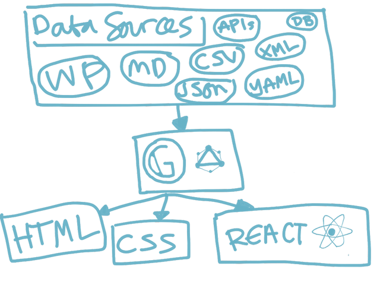
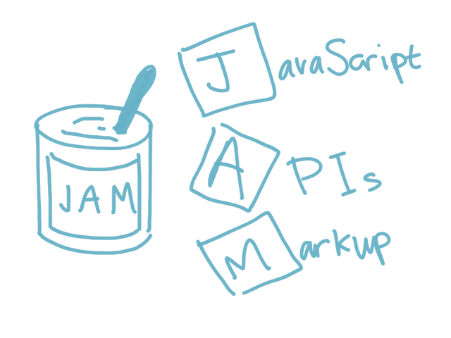
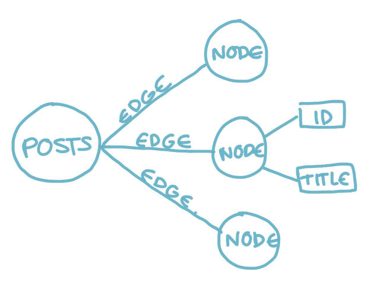

## Gatsby and WordPress

_Keeping it cheap and staying in touch_


## Schedule

- What we're going to make
- Background
- Setup
- WordPress plugin
- Creating content
- Deploy
- Summary


## What we're going to make

- Demo: Web Hook
  - [WordPress](https://wordsby.home.blog/)
  - [Gatsby](https://wordsby-bluepeter.netlify.com/)
  - [Netlify](https://app.netlify.com/sites/wordsby-bluepeter/deploys)


## Background




### JAM stack




## Setup

- Install Gatsby CLI [(Docs)](https://www.gatsbyjs.org/docs/quick-start)
- Create a new site [(Gatsby Starter)](https://gatsby-starter-default-demo.netlify.com/)
- Start Gatsby


## Setup (cont.)

```bash
yarn global add gatsby-cli
gatsby new hello-world <URL to Gatsby starter>
gatsby develop
```


## WordPress plugin

`3ee8aae`

- Install the WordPress plugin
  - [Gatsby plugins](https://www.gatsbyjs.org/plugins/) / [GitHub](https://github.com/gatsbyjs/gatsby/tree/master/packages/gatsby-source-wordpress)


## WordPress plugin (cont.)

- Get WordPress tokens
  - [develop.wordpress.com](https://developer.wordpress.com/apps/64283/)


## WordPress plugin (cont.)

- Configure the plugin
  - Secrets (.env)
  - Routes


## WordPress plugin (cont.)

- Verify the plugin works (GraphQL detour)


## Reading GraphQL

```graphql
{
  allWordpressPost {
    edges {
      node {
        id
        title
      }
    }
  }
}
```


## Reading GraphQL (cont.)



## Creating content

`2249ea8`

- Gatsby APIs
  - Node
    - [createPage](https://www.gatsbyjs.org/docs/node-apis/#createPages)
    - Flow


## Creating content (cont.)

- Demo: [view content & 404 dev page](http://localhost:8000/xyz)


## Creating content (cont.)

- Template
  - createPage
  - Layout
    - dangerouslySetInnerHTML
    - JSX


## Creating content (cont.)

- Demo: [index page](http://localhost:8000/)


## Deploy

- Demo: Create a [new](https://app.netlify.com/start) Netlify site
- [Environmental variables](https://app.netlify.com/sites/wordsby-bluepeter/settings/deploys#build-environment-variables)


## Deploy (cont.)

- Demo: Webhooks [Netlify](https://app.netlify.com/sites/wordsby-bluepeter/settings/deploys#build-environment-variables) [WordPress](https://wordsbyhome.wordpress.com/wp-admin/options-general.php?page=webhooks)


## Deploy (cont.)

- PWA [plugin](https://github.com/gatsbyjs/gatsby/tree/master/packages/gatsby-plugin-offline)
  - Demo: Lighthouse


  ## Summary

- :) Gatsby's is pretty cool
- ;) So's WordPress
- :D Gatsby API and ecosphere are hawt
- :( No deltas
- :P [wp-graphql](https://github.com/wp-graphql/wp-graphql)
- :P [themes](https://www.gatsbyjs.org/blog/2018-11-11-introducing-gatsby-themes/)
